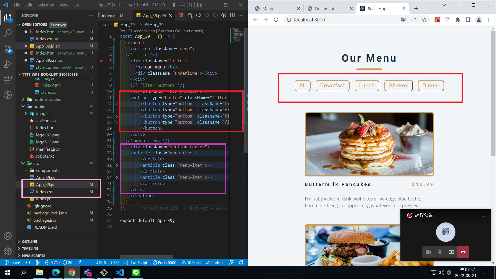
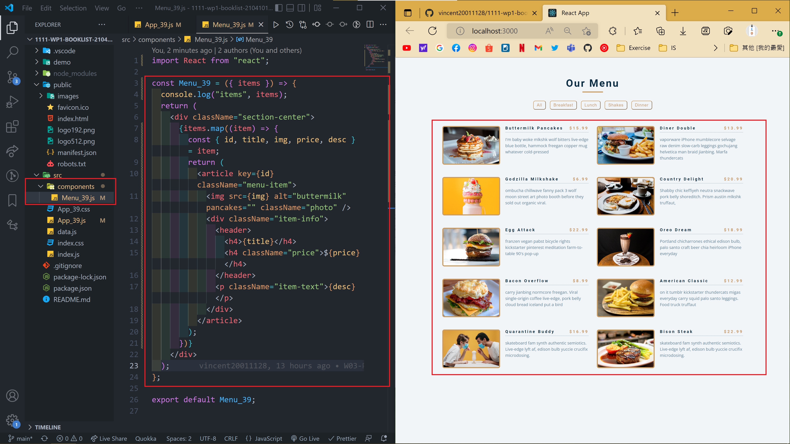
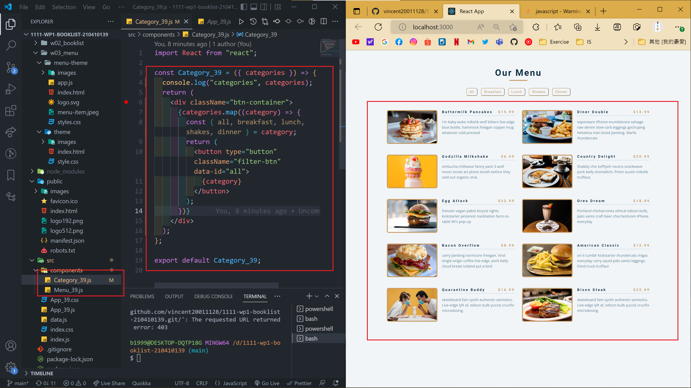
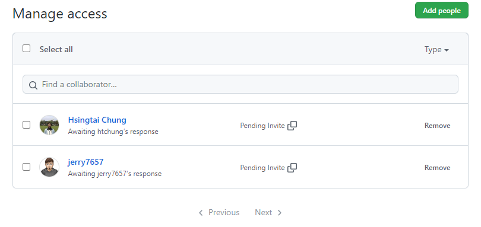

### W03-P1: show menu with 5 buttons and 3 meals

### W03-P2: show all meals using data.js (array)

### W03-P3: W03-P3: show all categories using array

### W03-P4: show all Github collaborator (teacher & TA)

### W03-logs: show all four logs done today

由於出現認證狀況 導致 push 不上去學校的 github 

新建另一隻本地端帳號後成功 

