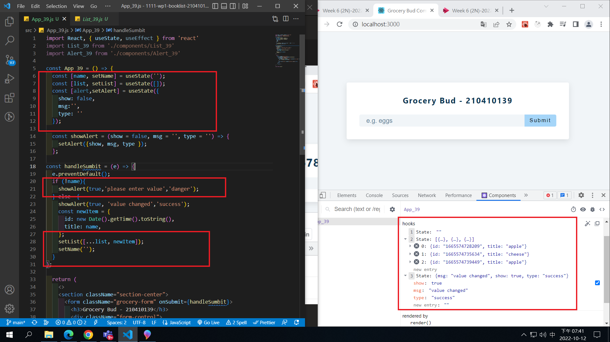
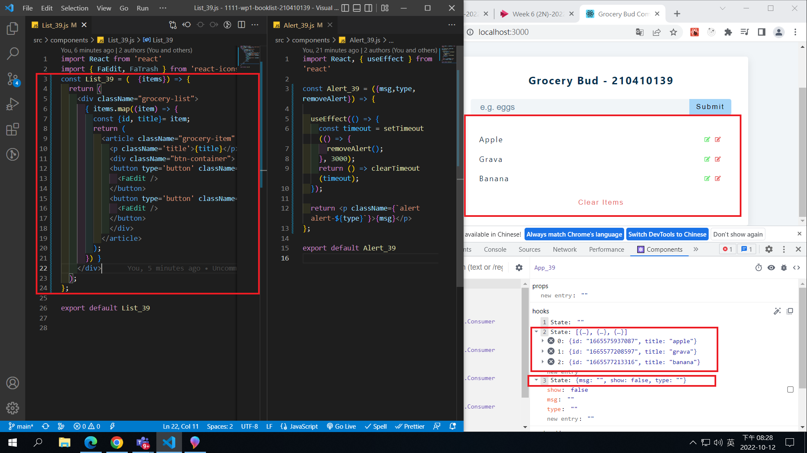
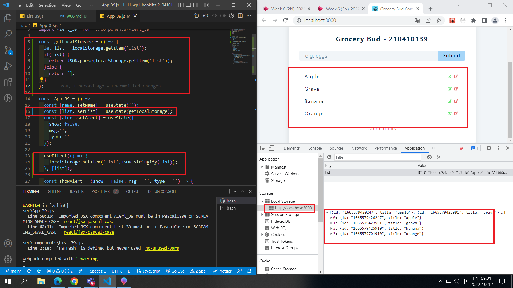
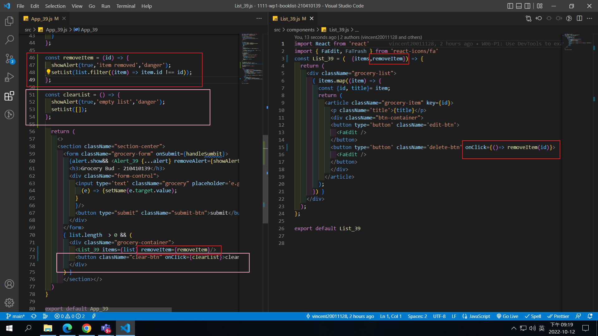
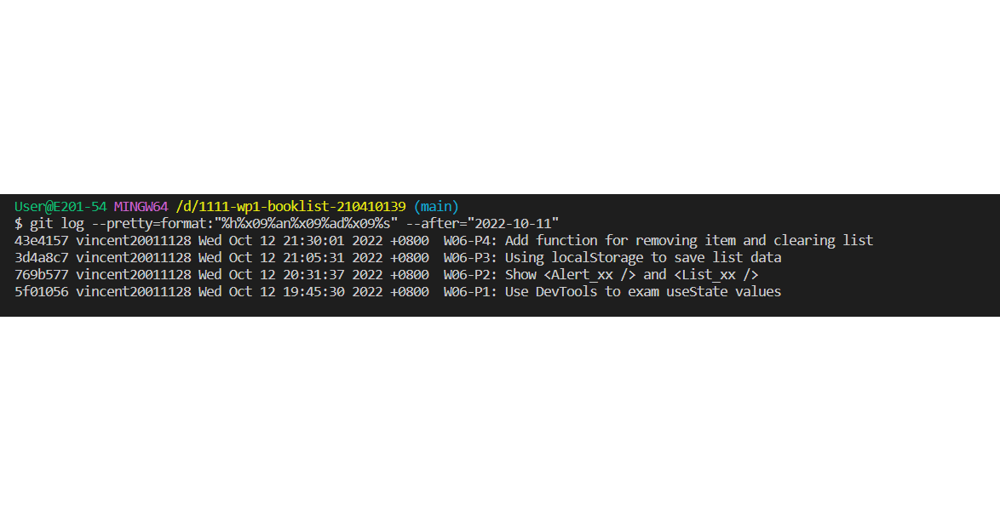

[Github URL](https://github.com/vincent20011128/1111-wp1-booklist-210410139/blob/main/demo/md/w06_grocery/w06.md)

### W06-P1: Use DevTools to exam useState values

### W06-P2: Show <Alert_xx /> and <List_xx />

### W06-P3: Using localStorage to save list data

### W06-P4: Add function for removing item and clearing list

### W06-logs: show all four logs done today

