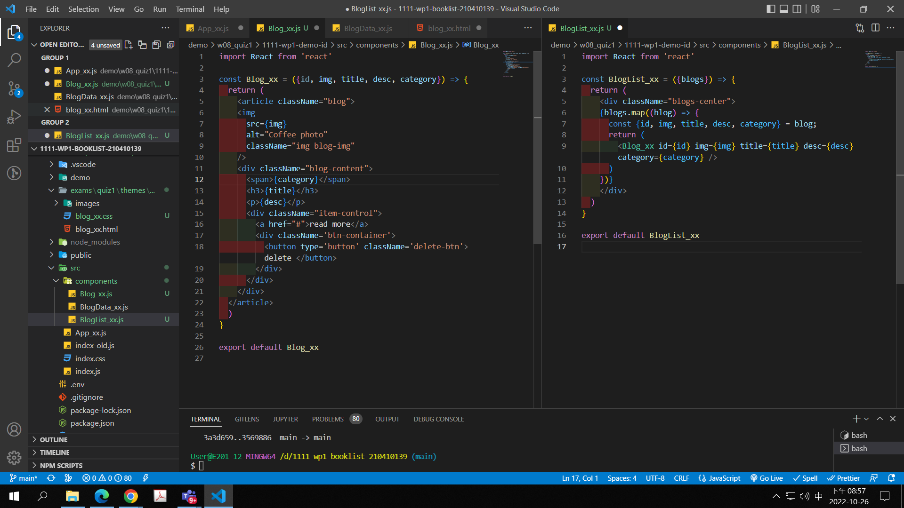
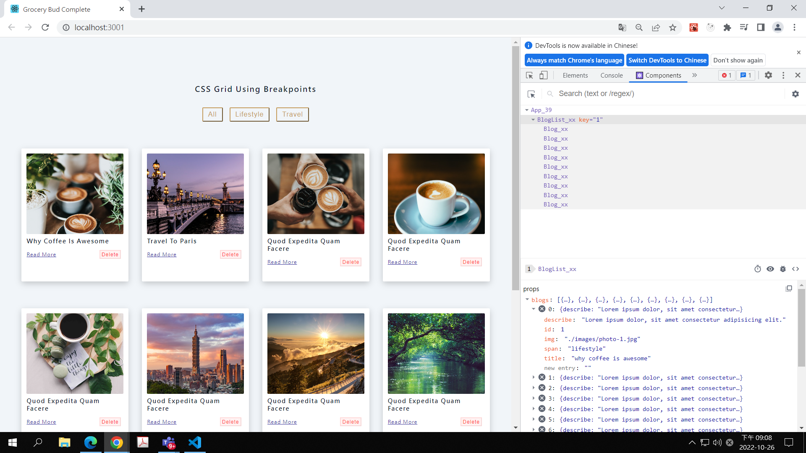
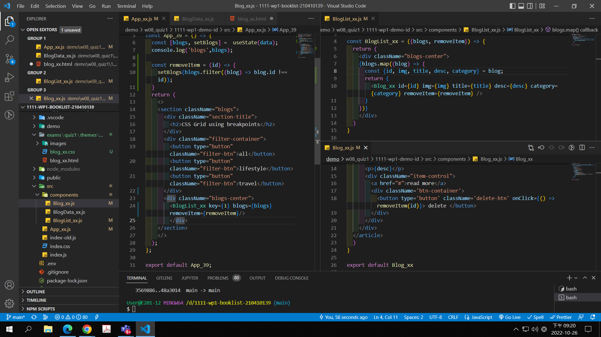
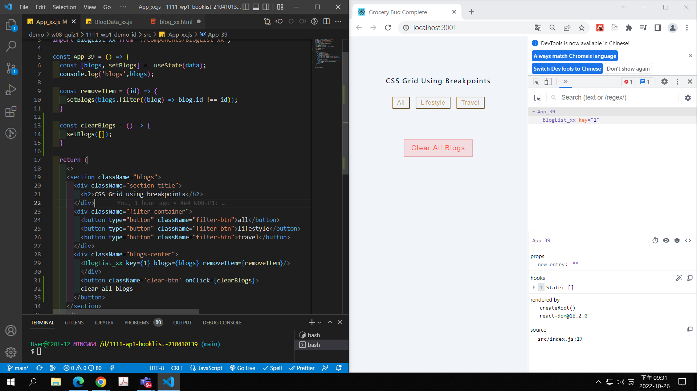
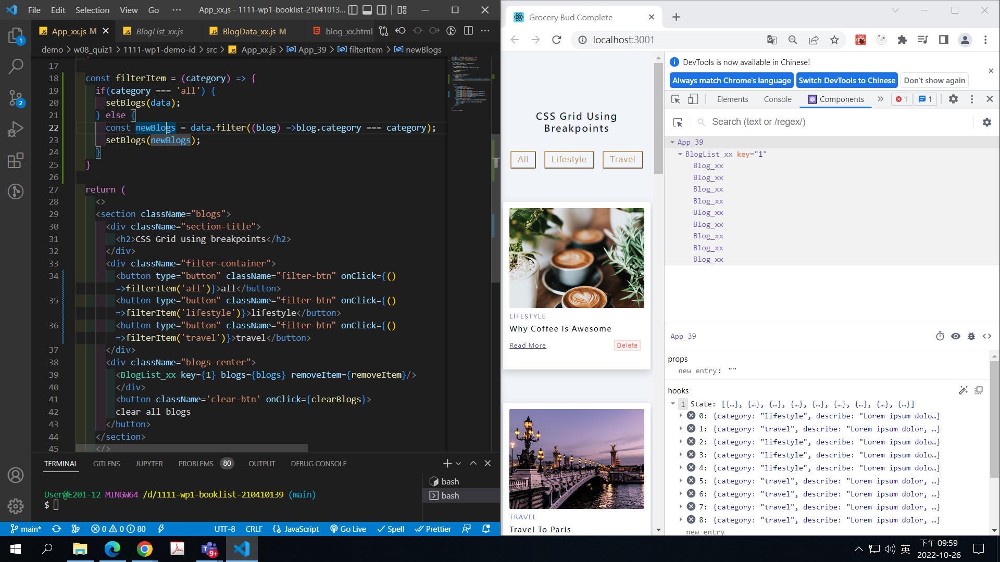
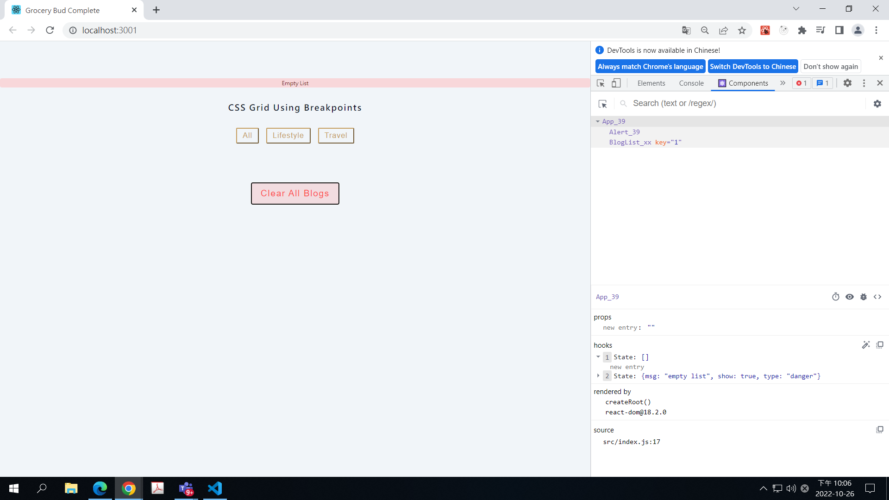
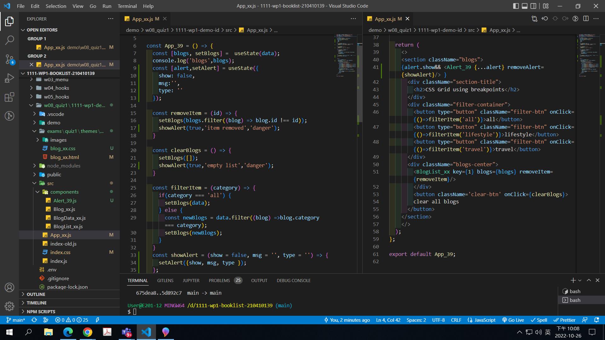
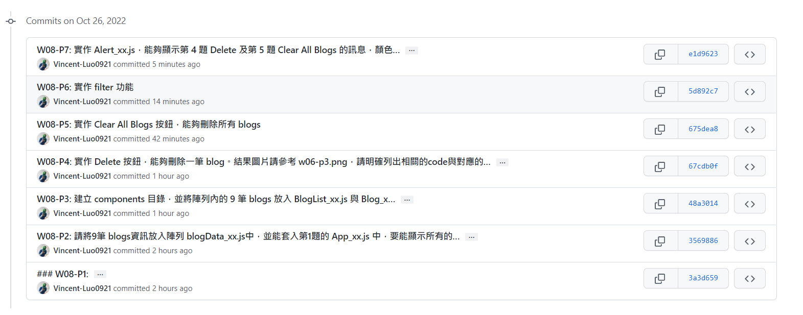

[Github URL](https://github.com/vincent20011128/1111-wp1-booklist-210410139/blob/main/demo/md/w06_grocery/w06.md)

### W08-P1: a. 依學號從後往前，顯示對應的四筆 blog，結果圖片請參考 w01-p1.png; b. 顯示 filter 篩選按鈕，結果圖片請參考 w03-p1.png

### W08-P2: 請將 9 筆 blogs 資訊放入陣列 blogData_xx.js 中，並能套入第 1 題的 App_xx.js 中，要能顯示所有的 blogs

### W08-P3: 建立 components 目錄，並將陣列內的 9 筆 blogs 放入 BlogList_xx.js 與 Blog_xx.js 中

### W08-P4: 實作 Delete 按鈕，能夠刪除一筆 blog。結果圖片請參考 w06-p3.png，請明確列出相關的 code 與對應的結果圖片，不需要實作 local storage，要透過 Chrome DevTool 之 React components 來顯示

### W08-P5: 實作 Clear All Blogs 按鈕，能夠刪除所有 blogs

### W08-P6: 實作 filter 功能

### W08-P7: 實作 Alert_xx.js，能夠顯示第 4 題 Delete 及第 5 題 Clear All Blogs 的訊息，顏色都是 danger 的紅色。

### W08-logs: show all four logs done today

