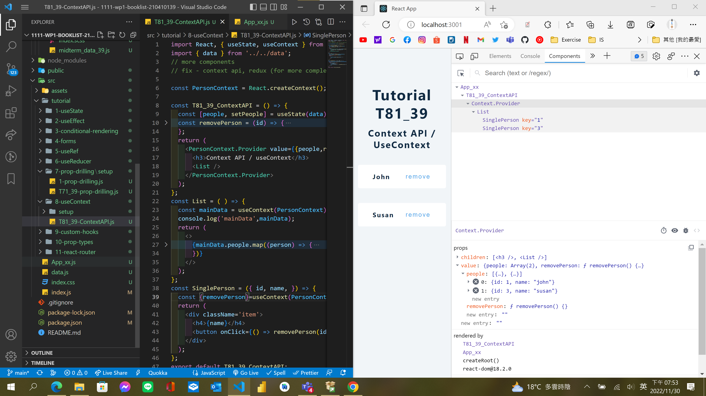
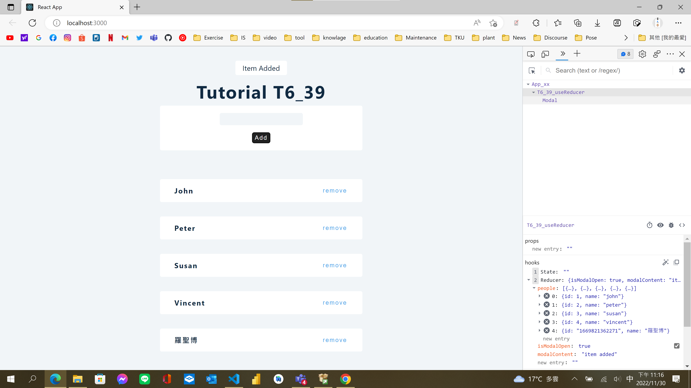
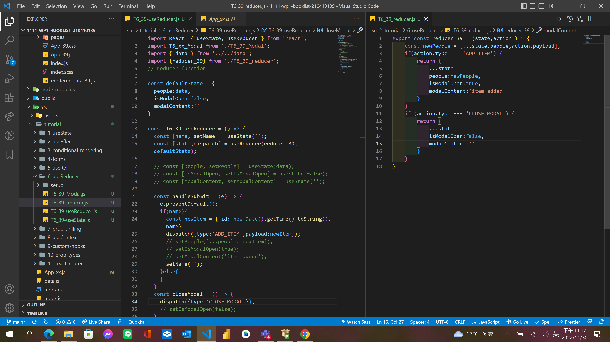
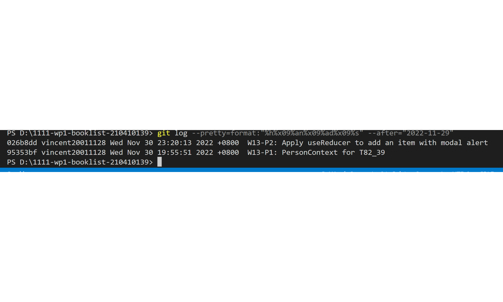

[Github URL](https://github.com/vincent20011128/1111-wp1-booklist-210410139/blob/main/demo/md/w13/w13.md)

### W13-P1: PersonContext for T82_xx

### W13-P2: Apply useReducer to add an item with modal alert

### W13-P3: Apply useContext to solve quiz 1 problem with prop drilling

### git log

