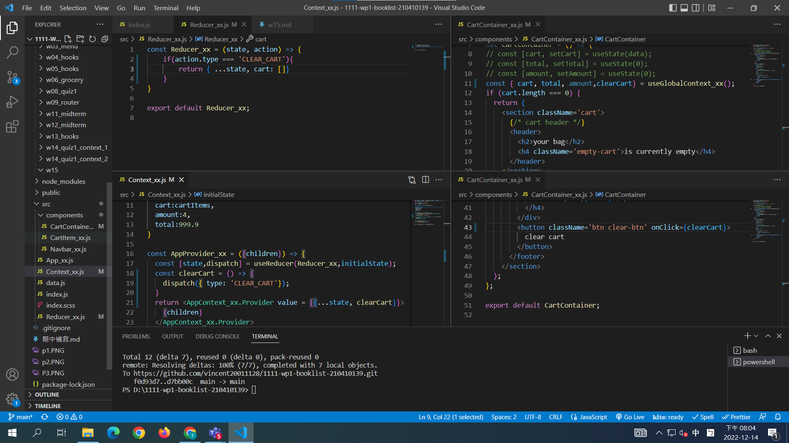
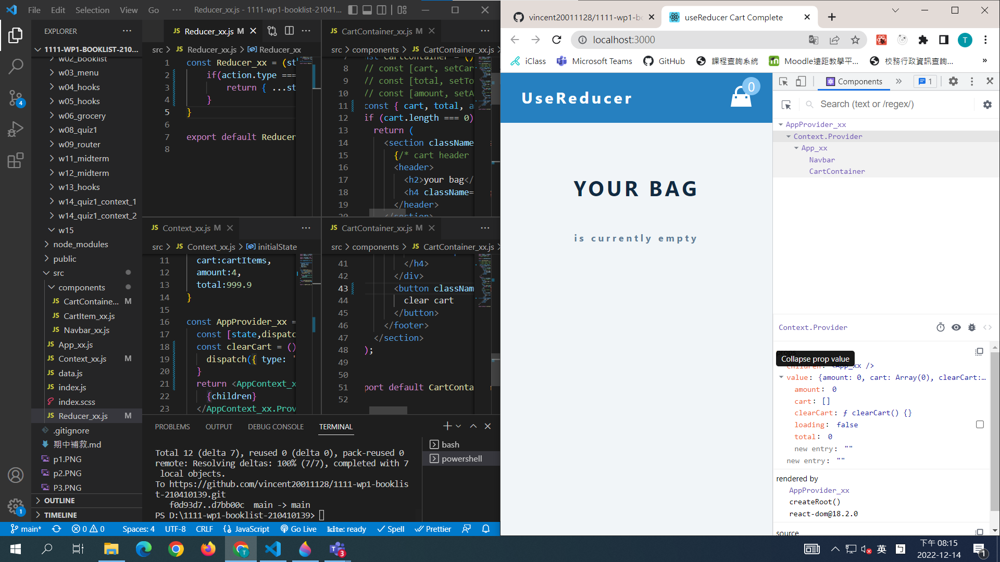

[Github URL](https://github.com/vincent20011128/1111-wp1-booklist-210410139/blob/main/demo/md/w13/w13.md)

### W15-P1: Setup AppProvider_xx for App_xx and get state data

### W15-P2: replace data in CartContainer using global context

### W15-P3: put clear cart function in global context

### W15-P4: provide increase and get total function in global context

### git log

