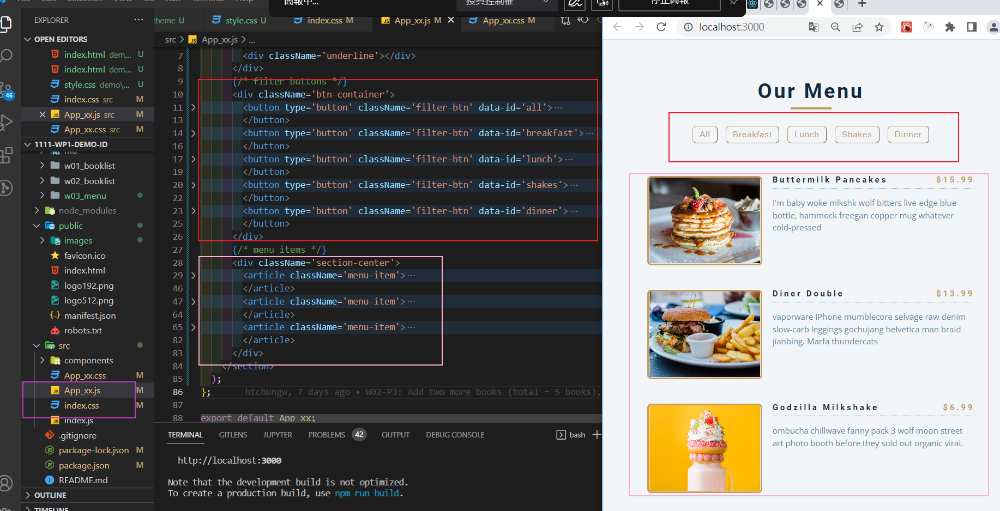
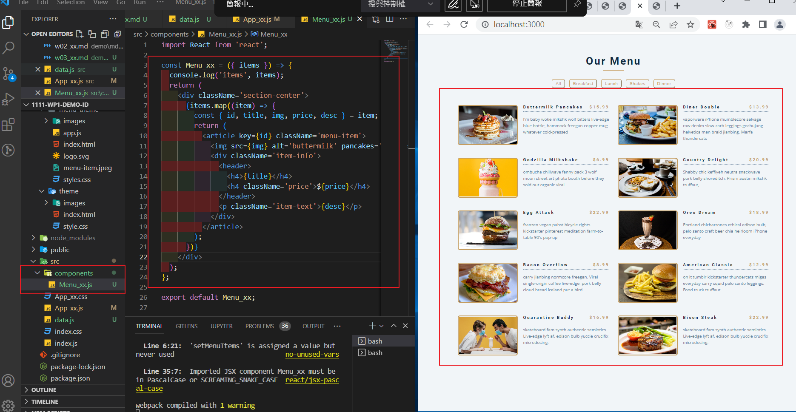
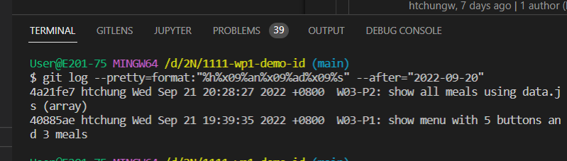

### W03-P1: show menu with 5 buttons and 3 meals

### W03-P2: show all meals using data.js (array) 

### W03-P3: W03-P3: show all categories using array

### W03-P4: show all Github collaborator (teacher & TA)

### W03-logs: show all four logs done today

