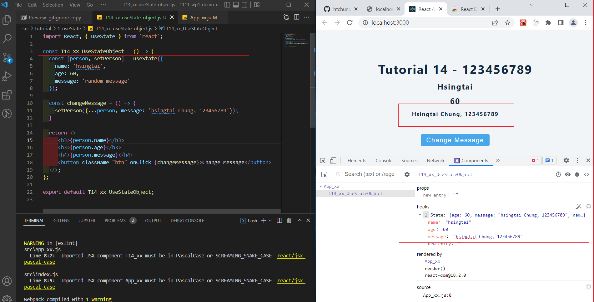
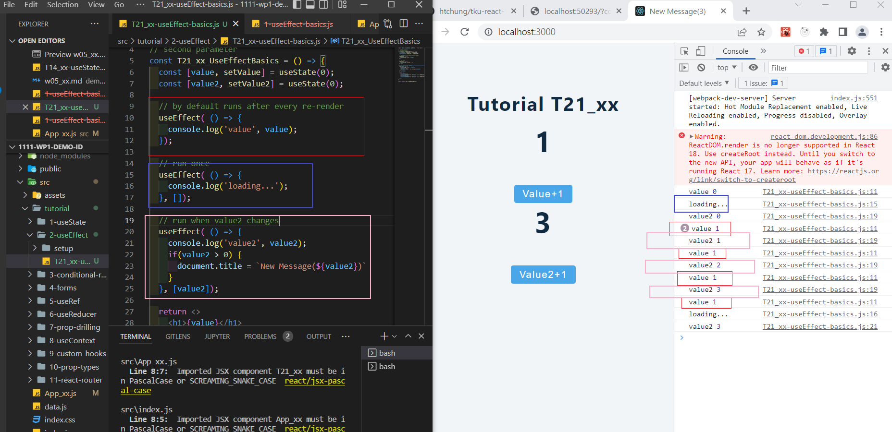
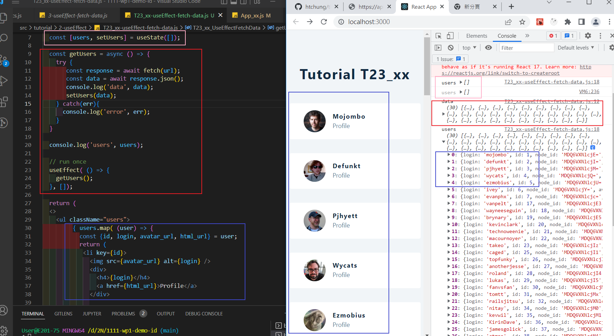
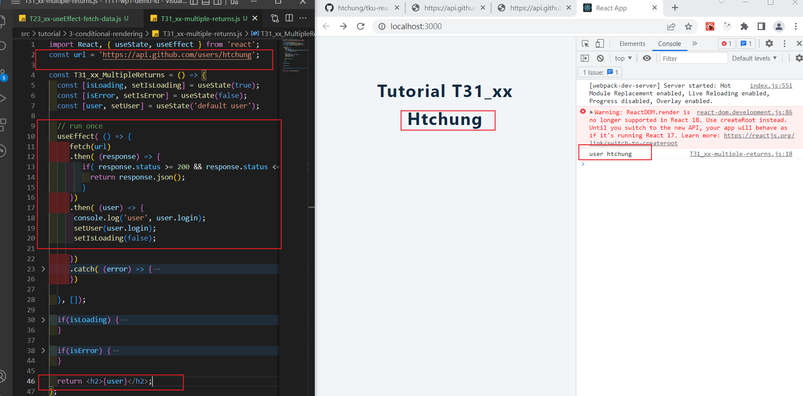
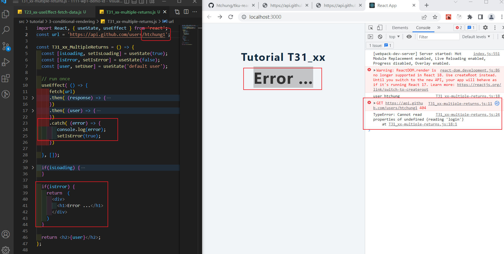
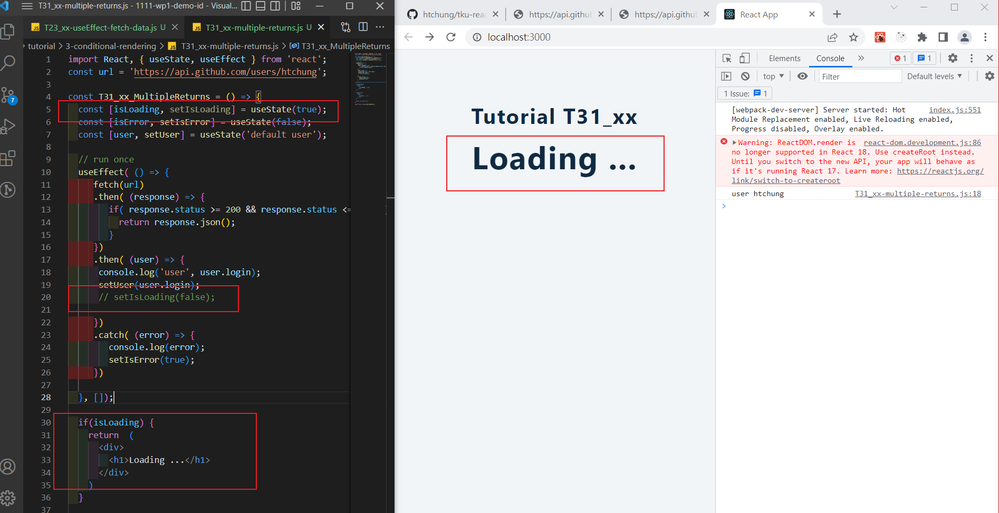
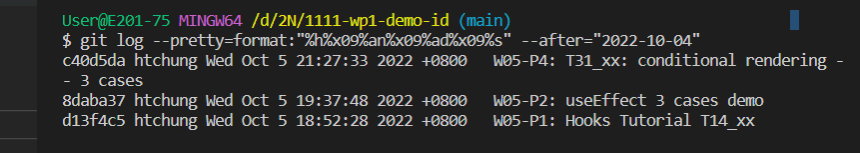

### W05-P1: Hooks Tutorial T14_xx



### W05-P2: T21_xx: useEffect 3 cases demo



### W05-P3: T23_xx: fetch data from Github and display them



### W05-P4: T31_xx: conditional rendering -- 3 cases







### W05-logs: show all four logs done today

[W05-logs URL](https://github.com/htchung/1111-wp1-demo-id/commit/b37365fb8ca5ac2fe13368763924aa8d552ca869)



```
$ git log --pretty=format:"%h%x09%an%x09%ad%x09%s" --after="2022-10-04"
c40d5da htchung Wed Oct 5 21:27:33 2022 +0800   W05-P4: T31_xx: conditional rendering -- 3 cases
8daba37 htchung Wed Oct 5 19:37:48 2022 +0800   W05-P2: useEffect 3 cases demo
d13f4c5 htchung Wed Oct 5 18:52:28 2022 +0800   W05-P1: Hooks Tutorial T14_xx

```
