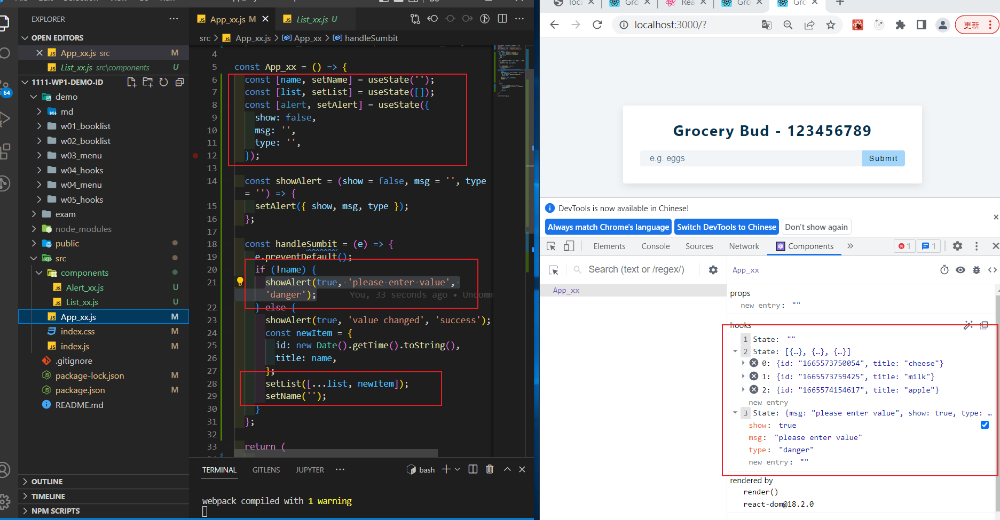
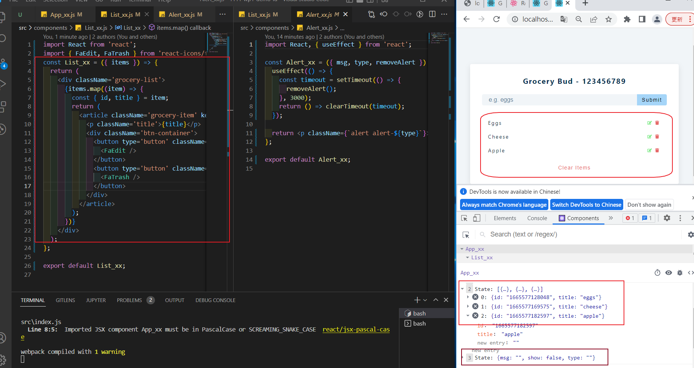
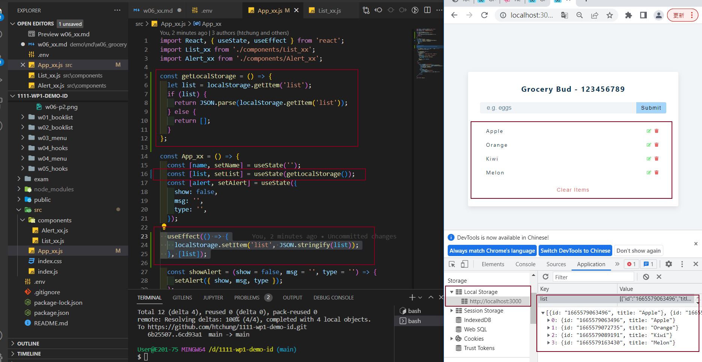
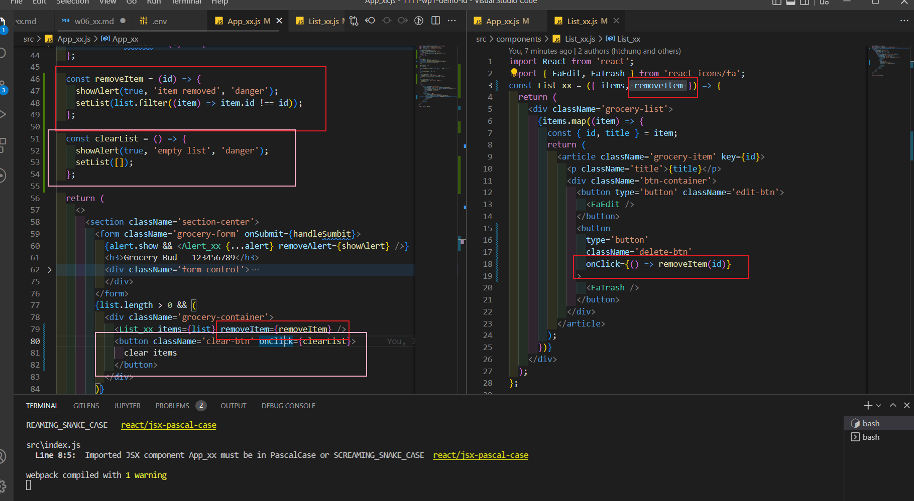
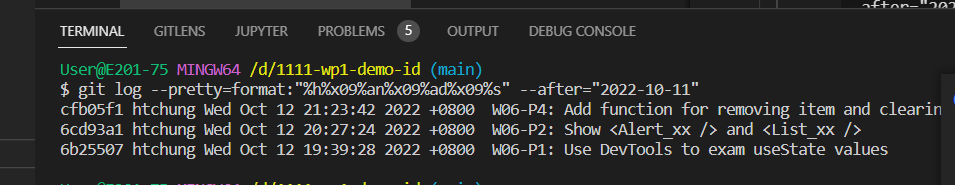

### W06-P1: Use DevTools to exam useState values



### W06-P2: Show <Alert_xx /> and <List_xx />



### W06-P3: Using localStorage to save list data



### W06-P4: Add function for removing item and clearing list



### W06-logs: show all four logs done today



```
$ git log --pretty=format:"%h%x09%an%x09%ad%x09%s" --after="2022-10-11"

a40b3d1 htchung Wed Oct 12 21:27:11 2022 +0800  copy w06 files
1fd262f htchung Wed Oct 12 21:25:51 2022 +0800  W06-logs: show all four logs done today
cfb05f1 htchung Wed Oct 12 21:23:42 2022 +0800  W06-P4: Add function for removing item and clearing list
6cd93a1 htchung Wed Oct 12 20:27:24 2022 +0800  W06-P2: Show <Alert_xx /> and <List_xx />
6b25507 htchung Wed Oct 12 19:39:28 2022 +0800  W06-P1: Use DevTools to exam useState values
```
