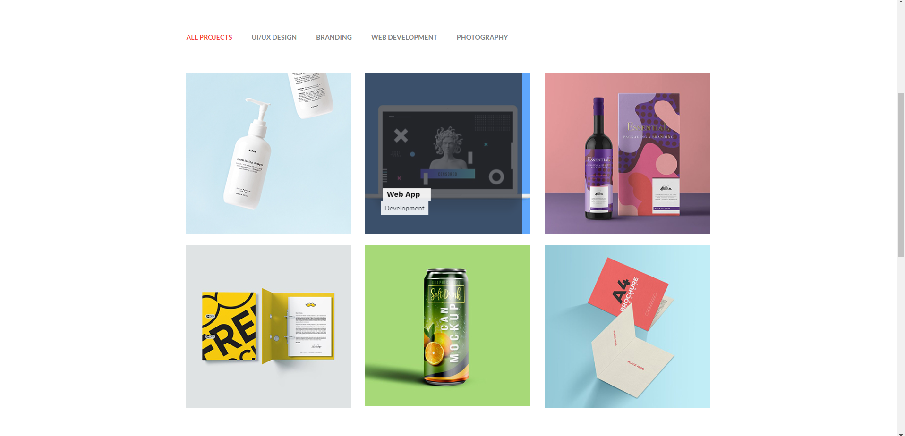

### 學號 姓名 補救教學

### 第一部分

#### 1.1 提供 theme 來源 URL 及圖片:

Theme 來源網址: [Theme](https://themefisher.com/products/thomson)<br>
Theme 截圖: 

#### 1.2 theme 介紹:

本 Theme 可以拆分成以下部分

1. 側面 Menu，共可分成 5 個種類
   

```
<div>...</div>
```

> 文字說明
> 可以拆解為 ALL PROJECTS、UI/UC DESIGN、BRANDING、WEB DEVELOPMENT、PHOTOGRAPHY

2. 卡片區，可顯示產品圖片、名稱、價格、種類
   

```
<div>...</div>
```

> 文字說明
> 當游標放到產品卡上面 會顯示名稱及種類

---

### 第二部分
